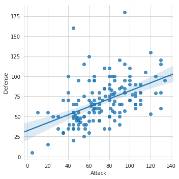
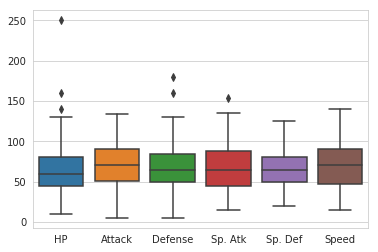
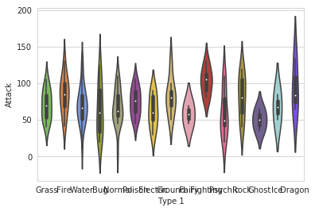
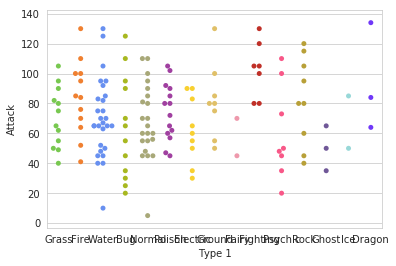
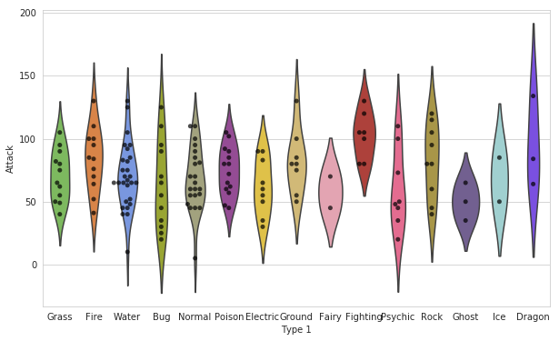
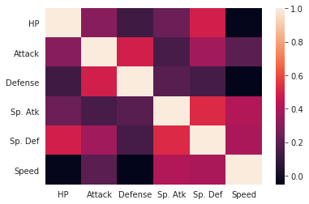
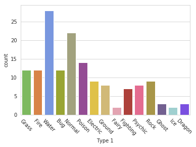
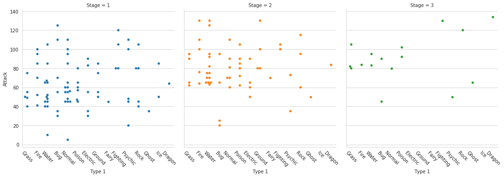
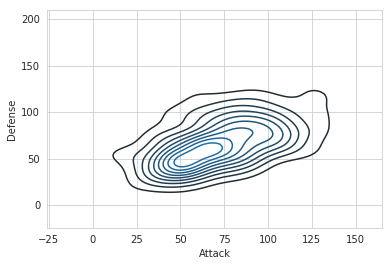

```
comparing attack stats vs. defense stats


```





```
hue allows addition of another dimension, fit_reg=False removes regression line


```


```

```








```
#swarm plots 
```





```
#swarm + violin plots
## figure size

```


 





```
 1. Enlarge the plot
 2. Separate points by hue
 3. Use Pokemon palette
 
 4. Adjust the y-axis

 
 5. Place legend to the right

```


```
Heatmap
```








```
 Factor Plot
```





```
 Density Plot

```





```
Joint Plot

```


    


