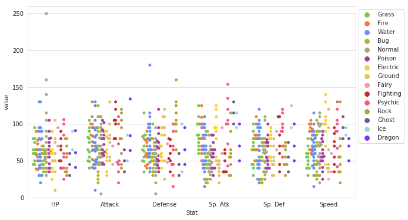

```
from google.colab import drive
drive.mount('/content/gdrive', force_remount=True)
root_dir = "/content/gdrive/My Drive/"
base_dir = root_dir + 'Colab Notebooks/colab datasets/Pokemon.csv'
```

    Mounted at /content/gdrive


```
import pandas as pd
from matplotlib import pyplot as plt
import seaborn as sns
```


```
df = pd.read_csv(base_dir,index_col=0,encoding='latin1')
df.head()
```


<div>
<style scoped>
    .dataframe tbody tr th:only-of-type {
        vertical-align: middle;
    }

    .dataframe tbody tr th {
        vertical-align: top;
    }

    .dataframe thead th {
        text-align: right;
    }
</style>
<table border="1" class="dataframe">
  <thead>
    <tr style="text-align: right;">
      <th></th>
      <th>Name</th>
      <th>Type 1</th>
      <th>Type 2</th>
      <th>Total</th>
      <th>HP</th>
      <th>Attack</th>
      <th>Defense</th>
      <th>Sp. Atk</th>
      <th>Sp. Def</th>
      <th>Speed</th>
      <th>Stage</th>
      <th>Legendary</th>
    </tr>
    <tr>
      <th>#</th>
      <th></th>
      <th></th>
      <th></th>
      <th></th>
      <th></th>
      <th></th>
      <th></th>
      <th></th>
      <th></th>
      <th></th>
      <th></th>
      <th></th>
    </tr>
  </thead>
  <tbody>
    <tr>
      <th>1</th>
      <td>Bulbasaur</td>
      <td>Grass</td>
      <td>Poison</td>
      <td>318</td>
      <td>45</td>
      <td>49</td>
      <td>49</td>
      <td>65</td>
      <td>65</td>
      <td>45</td>
      <td>1</td>
      <td>False</td>
    </tr>
    <tr>
      <th>2</th>
      <td>Ivysaur</td>
      <td>Grass</td>
      <td>Poison</td>
      <td>405</td>
      <td>60</td>
      <td>62</td>
      <td>63</td>
      <td>80</td>
      <td>80</td>
      <td>60</td>
      <td>2</td>
      <td>False</td>
    </tr>
    <tr>
      <th>3</th>
      <td>Venusaur</td>
      <td>Grass</td>
      <td>Poison</td>
      <td>525</td>
      <td>80</td>
      <td>82</td>
      <td>83</td>
      <td>100</td>
      <td>100</td>
      <td>80</td>
      <td>3</td>
      <td>False</td>
    </tr>
    <tr>
      <th>4</th>
      <td>Charmander</td>
      <td>Fire</td>
      <td>NaN</td>
      <td>309</td>
      <td>39</td>
      <td>52</td>
      <td>43</td>
      <td>60</td>
      <td>50</td>
      <td>65</td>
      <td>1</td>
      <td>False</td>
    </tr>
    <tr>
      <th>5</th>
      <td>Charmeleon</td>
      <td>Fire</td>
      <td>NaN</td>
      <td>405</td>
      <td>58</td>
      <td>64</td>
      <td>58</td>
      <td>80</td>
      <td>65</td>
      <td>80</td>
      <td>2</td>
      <td>False</td>
    </tr>
  </tbody>
</table>
</div>


```
#comparing attack stats vs. defense stats
sns.lmplot(x='Attack', y='Defense', data=df)

```


    <seaborn.axisgrid.FacetGrid at 0x7fe4b2e41b70>


```
#hue allows addition of another dimension, fit_reg=False removes regression line
sns.lmplot('Attack','Defense',data = df,hue='Stage',fit_reg=False)

```


    <seaborn.axisgrid.FacetGrid at 0x7fe4b2e7d4e0>


```
df_dropped = df.drop(['Total','Stage','Legendary'],axis=1)
sns.boxplot(data=df_dropped)
sns.set_style('whitegrid')
```


```
pkmn_type_colors = ['#78C850',  # Grass
                    '#F08030',  # Fire
                    '#6890F0',  # Water
                    '#A8B820',  # Bug
                    '#A8A878',  # Normal
                    '#A040A0',  # Poison
                    '#F8D030',  # Electric
                    '#E0C068',  # Ground
                    '#EE99AC',  # Fairy
                    '#C03028',  # Fighting
                    '#F85888',  # Psychic
                    '#B8A038',  # Rock
                    '#705898',  # Ghost
                    '#98D8D8',  # Ice
                    '#7038F8',  # Dragon
                   ]
```


```
sns.violinplot(x = 'Type 1', y ='Attack',data=df,palette =pkmn_type_colors )
```


    <matplotlib.axes._subplots.AxesSubplot at 0x7fe4b2a860b8>


```
#swarm plots 
sns.swarmplot(x='Type 1', y ='Attack',data =df, palette = pkmn_type_colors)
```


    <matplotlib.axes._subplots.AxesSubplot at 0x7fe4b29bf7f0>


```
#swarm + violin plots
## figure size
plt.figure(figsize=(10,6))

sns.violinplot(x = 'Type 1', y ='Attack',inner=None,data=df,palette =pkmn_type_colors )
sns.swarmplot(x='Type 1', y ='Attack', data=df,color='black', alpha=0.7)
```


    <matplotlib.axes._subplots.AxesSubplot at 0x7fe4b28580f0>


```
#melted dataframe
melted_df = pd.melt(df_dropped, 
                    id_vars=["Name", "Type 1", "Type 2"], # Variables to keep
                    var_name="Stat")
melted_df.head()
```


<div>
<style scoped>
    .dataframe tbody tr th:only-of-type {
        vertical-align: middle;
    }

    .dataframe tbody tr th {
        vertical-align: top;
    }

    .dataframe thead th {
        text-align: right;
    }
</style>
<table border="1" class="dataframe">
  <thead>
    <tr style="text-align: right;">
      <th></th>
      <th>Name</th>
      <th>Type 1</th>
      <th>Type 2</th>
      <th>Stat</th>
      <th>value</th>
    </tr>
  </thead>
  <tbody>
    <tr>
      <th>0</th>
      <td>Bulbasaur</td>
      <td>Grass</td>
      <td>Poison</td>
      <td>HP</td>
      <td>45</td>
    </tr>
    <tr>
      <th>1</th>
      <td>Ivysaur</td>
      <td>Grass</td>
      <td>Poison</td>
      <td>HP</td>
      <td>60</td>
    </tr>
    <tr>
      <th>2</th>
      <td>Venusaur</td>
      <td>Grass</td>
      <td>Poison</td>
      <td>HP</td>
      <td>80</td>
    </tr>
    <tr>
      <th>3</th>
      <td>Charmander</td>
      <td>Fire</td>
      <td>NaN</td>
      <td>HP</td>
      <td>39</td>
    </tr>
    <tr>
      <th>4</th>
      <td>Charmeleon</td>
      <td>Fire</td>
      <td>NaN</td>
      <td>HP</td>
      <td>58</td>
    </tr>
  </tbody>
</table>
</div>


```
# 1. Enlarge the plot
plt.figure(figsize=(10,6))
 
sns.swarmplot(x='Stat', 
              y='value', 
              data=melted_df, 
              hue='Type 1', 
              split=True, # 2. Separate points by hue
              palette=pkmn_type_colors) # 3. Use Pokemon palette
 
# 4. Adjust the y-axis
plt.ylim(0, 260)
 
# 5. Place legend to the right
plt.legend(bbox_to_anchor=(1, 1), loc=2)
```

    /usr/local/lib/python3.6/dist-packages/seaborn/categorical.py:2974: UserWarning: The `split` parameter has been renamed to `dodge`.
      warnings.warn(msg, UserWarning)


    <matplotlib.legend.Legend at 0x7fe4b0d5d080>





```
#heatmap
corr = df_dropped.corr()
sns.heatmap(corr)
```


    <matplotlib.axes._subplots.AxesSubplot at 0x7fe4b0cee4a8>


```
sns.distplot(df.Attack)

```


    <matplotlib.axes._subplots.AxesSubplot at 0x7fe4b0d14b70>


```
sns.countplot(x='Type 1', data=df, palette=pkmn_type_colors)
plt.xticks(rotation=-45)

```


    (array([ 0,  1,  2,  3,  4,  5,  6,  7,  8,  9, 10, 11, 12, 13, 14]),
     <a list of 15 Text xticklabel objects>)


```
# Factor Plot
g = sns.factorplot(x='Type 1', 
                   y='Attack', 
                   data=df, 
                   hue='Stage',  # Color by stage
                   col='Stage',  # Separate by stage
                   kind='swarm') # Swarmplot
 
# Rotate x-axis labels
g.set_xticklabels(rotation=-45)
```

    /usr/local/lib/python3.6/dist-packages/seaborn/categorical.py:3666: UserWarning: The `factorplot` function has been renamed to `catplot`. The original name will be removed in a future release. Please update your code. Note that the default `kind` in `factorplot` (`'point'`) has changed `'strip'` in `catplot`.
      warnings.warn(msg)


    <seaborn.axisgrid.FacetGrid at 0x7fe4af926a90>


```
# Density Plot
sns.kdeplot(df.Attack, df.Defense)
```


    <matplotlib.axes._subplots.AxesSubplot at 0x7fe4af6e6588>


```
sns.jointplot(x='Attack', y='Defense', data=df)

```


    <seaborn.axisgrid.JointGrid at 0x7fe4b0facf28>


